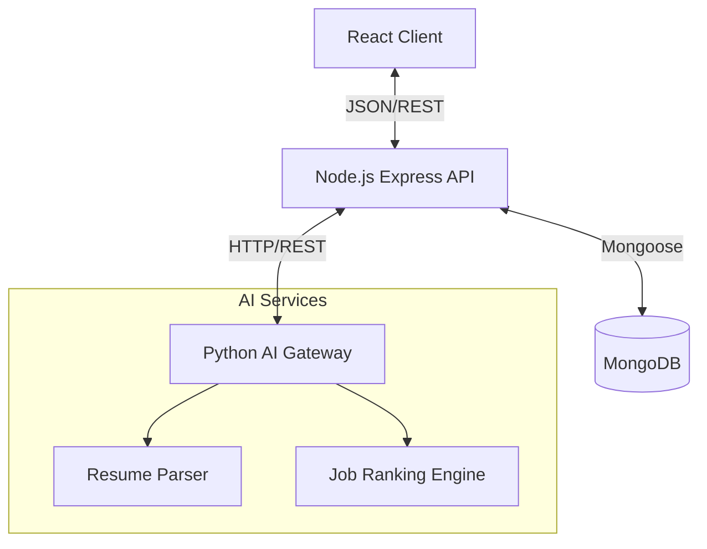

# System Architecture & Technology Stack

## 1. Technology Stack Justification

### Core Stack: MERN + Python (Microservices)

We selected a hybrid architecture combining **MERN (MongoDB, Express, React, Node.js)** for the core application and **Python (FastAPI)** for AI services.

| Component | Technology | Justification |
|-----------|------------|---------------|
| **Frontend** | React + Vite + TypeScript | **React** offers a component-based UI for modular development. **Vite** provides lightning-fast build times. **TypeScript** ensures type safety, reducing runtime errors in a complex dashboard environment. |
| **Styling** | Tailwind CSS + Framer Motion | **Tailwind** allows rapid UI development with a utility-first approach. **Framer Motion** adds professional micro-interactions (animations) required for a "premium" feel. |
| **Backend** | Node.js + Express | Non-blocking I/O is ideal for handling concurrent user requests (students applying, recruiters posting). JavaScript everywhere (frontend + backend) simplifies development. |
| **Database** | MongoDB (Mongoose) | Flexible schema design is perfect for dealing with unstructured data like Resume content, which varies per student. |
| **AI Layer** | Python + FastAPI | Python is the standard for AI/ML. **FastAPI** provides a high-performance, async API to expose our parsing (PyMuPDF) and ranking logic to the Node.js backend. |
| **State** | Zustand | Simpler and less boilerplate than Redux, perfect for managing user sessions and UI state. |

---

## 2. System Architecture

### High-Level Data Flow

1.  **User Interaction**: Client sends requests (e.g., "Upload Resume") to Node.js API.
2.  **Orchestration**: Node.js API handles authentication (JWT) and delegates complex tasks.
3.  **AI Processing**: Resume files are forwarded to the Python Gateway for parsing.
4.  **Persistence**: Structured data (skills, experience) is saved to MongoDB.
5.  **Response**: Processed data is sent back to the client for display.

---

## 3. Database Schema (ER Design)

### Entities

#### 1. User (Authentication)
| Field | Type | Description |
|-------|------|-------------|
| _id | ObjectId | Unique Identifier |
| email | String | Unique login credential |
| password | String | Bcrypt hashed password |
| role | Enum | 'student', 'recruiter', 'officer', 'admin' |

#### 2. Student (Profile)
*One-to-One with User*
| Field | Type | Description |
|-------|------|-------------|
| userId | ObjectId | Reference to User |
| usn | String | University Seat Number (Unique) |
| skills | String[] | Array of extracted skills |
| status | Enum | 'Placed', 'Unplaced', 'Offers Received' |
| branch | String | Department (CSE, ECE, etc.) |
| cgpa | Number | Academic Performance |

#### 3. Job (Listing)
*Many-to-One with Recruiter (User)*
| Field | Type | Description |
|-------|------|-------------|
| recruiterId | ObjectId | Reference to User (Recruiter) |
| title | String | Job Role |
| requirements | String[] | Skills required for AI matching |
| active | Boolean | Is the job open? |
| deadline | Date | Application closing date |

### Relationships
- **User 1:1 Student**: A generic user extends into a specific student profile.
- **Recruiter 1:N Jobs**: One recruiter can post multiple jobs.
- **Student N:N Jobs (Applications)**: Students can apply to multiple jobs (Join table: `Application`).

